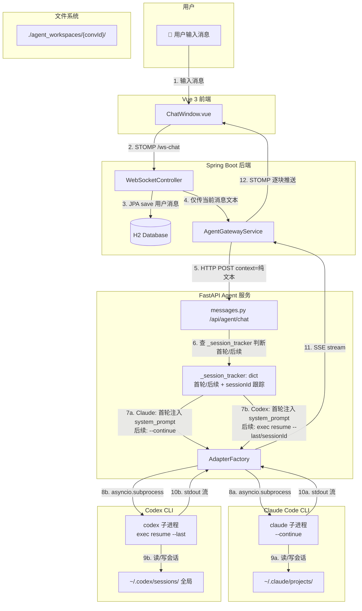
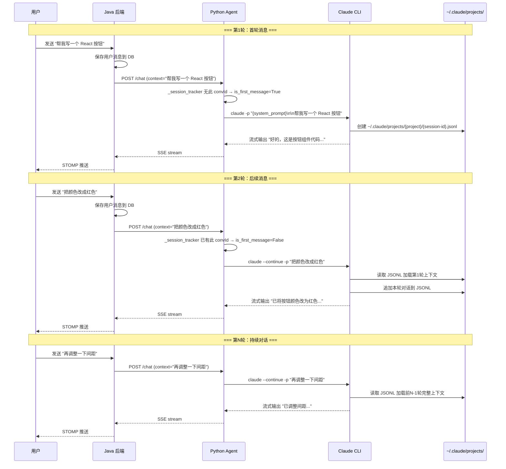
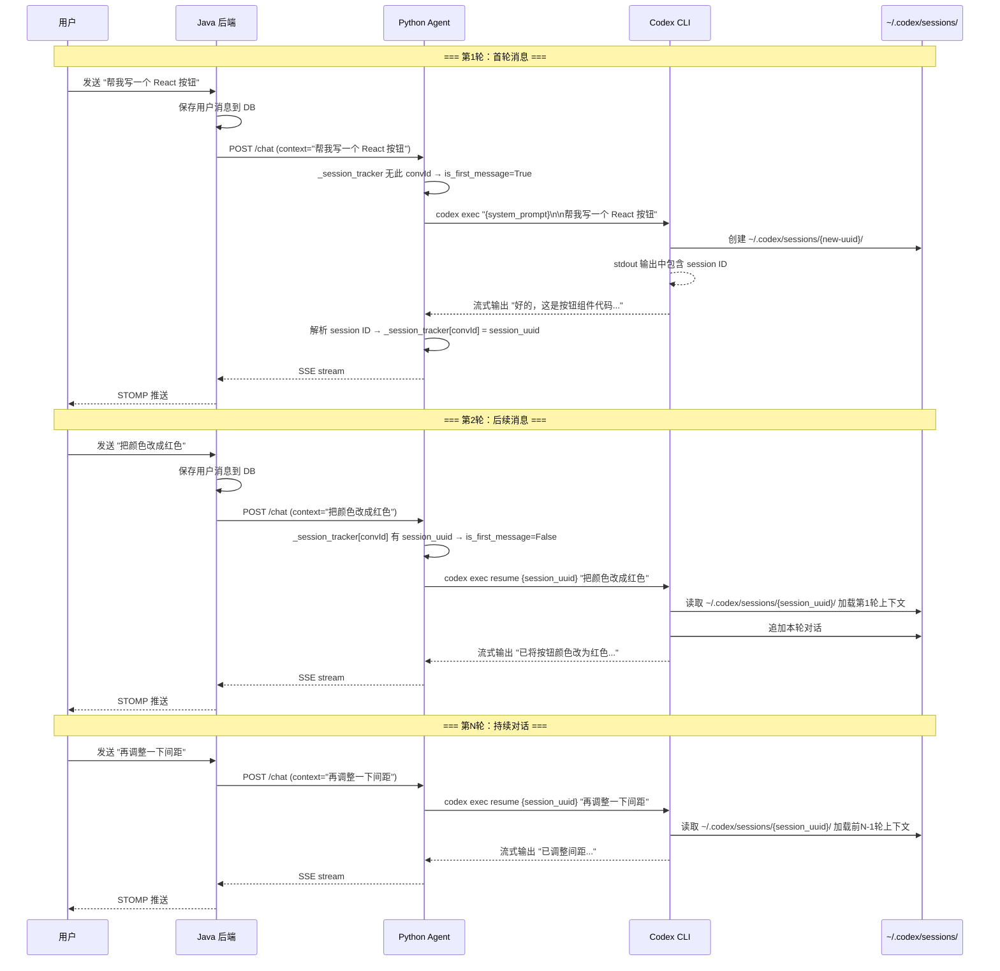
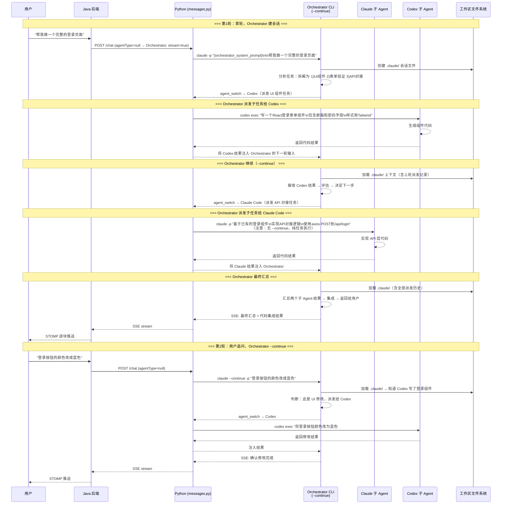

# AgentHub CLI 原生会话记忆设计方案

> **版本**: v3.1  
> **创建日期**: 2026-06-06  
> **最后更新**: 2026-06-07  
> **状态**: Claude Code 阶段 1 已实施，Codex + 多 Agent 待后续阶段  
> **依赖**:  
> - Claude Code CLI 内置 `--continue` / `--resume` 会话持久化 ✅ 已验证  
> - OpenAI Codex CLI 内置 `exec resume --last` / `exec resume <SESSION_ID>` 会话恢复（阶段 2）

## 实施现状

| 模块 | 状态 | 说明 |
|------|:--:|------|
| Claude Code `--continue` 集成 | ✅ **已完成** | Java 简化 + Python session tracker + `--continue` 分支，端到端验证通过 |
| Codex `exec resume` 集成 | ⏳ 阶段 2 | `is_first_message` 参数已预留，适配器逻辑待改造 |
| 多 Agent Orchestrator | ⏳ P2 | §8 设计保留，待 Orchestrator 整体开发时联动 |
| Windows 兼容修复 | ✅ 已合并 | `main.py` 添加 `WindowsSelectorEventLoopPolicy` |

### 实施中验证的关键事实

| 原假设 | 经验证 |
|--------|--------|
| 会话存储在 `{cwd}/.claude/sessions/` | 实际在 `~/.claude/projects/<project>/<session-id>.jsonl` |
| `--continue` 按 cwd 下 `.claude/` 查找 | 按 cwd 在全局 `~/.claude/projects/` 中查找，cwd 隔离仍生效 |
| 文件系统回退检查可行 | 已删除——全局路径无法从 cwd 反向查找，依赖纯 `_session_tracker` |
| Python 重启后可从文件恢复 | `_session_tracker` 丢失后误判首轮，每次会话浪费 1 次 system_prompt（已接受） |

---

## 1. 设计动机

### 1.1 当前架构的核心问题

在当前架构中，Java 后端在每次用户发送消息时，会从数据库查询最近 20 条历史消息，调用 `buildContextString()` 方法将所有对话拼接为一段平文本，随用户消息一起发给 Python Agent 服务，再由 Python 注入系统提示词后调用 CLI。

```
当前数据流（有问题）：
  用户消息 → Vue → STOMP → Java WebSocketController
    → buildContextString() 拼接 20 条历史消息
    → HTTP POST /api/agent/chat（context=历史+当前消息）
    → Python build_prompt() 再注入 system_prompt
    → claude/codex "{system_prompt}\n\n{history}\n\n{user_message}"  ← 每次全新调用
    → SSE 流式返回
```

**问题清单**：

| 问题 | 影响 | 严重程度 |
|------|------|---------|
| **上下文膨胀** | 每轮对话都重新发送全部历史，消息越多 context 越长，最终超出 CLI token 限制 | 高 |
| **系统提示词被淹没** | 1000+ 字的系统提示词与大量历史消息混杂，模型容易忽略指令 | 高 |
| **上下文格式不可控** | Java 端 `buildContextString()` 用自定义格式拼接，与 CLI 原生会话格式不兼容 | 中 |
| **重复计算** | 每轮对话都要查询 DB、拼接字符串、重新发送全部历史，浪费 I/O 和 token | 中 |
| **无法利用 CLI 原生记忆** | Claude Code（`--continue`）和 Codex（`exec resume --last`）都支持会话恢复，但当前架构每次都是全新调用，完全绕过了此能力 | 高 |

### 1.2 核心洞察：两种 CLI 都原生支持会话持久化

AgentHub 支持两种 CLI Agent，它们各自有成熟的会话持久化机制：

#### Claude Code CLI

每次执行后会将会话持久化到 `~/.claude/projects/<project>/` 目录下的 JSONL 文件中（`<project>` 从工作目录路径派生）：

```bash
claude -p "提问"                    # 创建新会话 → ~/.claude/projects/{project}/{session-id}.jsonl
claude --continue -p "追问"          # 按当前 cwd 自动加载最近会话的完整上下文
claude --resume <session-id> -p "..." # 恢复指定会话 ID
```

- 会话文件位置：`~/.claude/projects/<project-hash>/<session-id>.jsonl`
- **按 cwd 隔离**：`--continue` 在当前工作目录范围内查找最近会话，不同 cwd 互不干扰
- **注意**：`-p` 模式创建的会话不在交互式 `--resume` 选择器中显示，但仍可通过 `--resume <session-id>` 或 `--continue` 恢复（见[官方文档](https://code.claude.com/docs/zh-CN/sessions)）

#### OpenAI Codex CLI

每次执行后在**全局目录** `~/.codex/sessions/` 中持久化会话状态：

```bash
codex exec "提问"                                        # 创建新会话 → 保存到 ~/.codex/sessions/{uuid}/
codex exec resume --last "追问"                           # 恢复最近一次会话
codex exec resume <SESSION_ID> "追问"                     # 恢复指定会话
codex exec resume --last --cd ./workspace "追问"          # 恢复最近一次 + 指定工作目录
```

- 会话文件位置：`~/.codex/sessions/{session-uuid}/`（全局，**不按工作目录隔离**）
- **需要显式管理 session ID**：不同于 Claude 的 `--continue`（自动找当前目录最新），Codex 的 `--last` 是全局范围，需配合 `--cd` 指定工作目录

#### 统一结论

> 两种 CLI 都能自己记住对话。Java/Python 不需要再手动组装和传递历史消息。只需要在 Python 适配器层为每种 CLI 实现对应的首轮/后续调用策略。

### 1.3 两种 CLI 的会话模型对比

| 特性 | Claude Code CLI | Codex CLI |
|------|----------------|-----------|
| **会话存储位置** | `~/.claude/projects/<project>/<session-id>.jsonl`（全局目录，按 project 分桶） | `~/.codex/sessions/`（全局） |
| **会话隔离方式** | `--continue` 按 cwd 自动查找最近会话；不同 cwd 天然隔离 | 需跟踪 session ID + `--cd` |
| **首轮命令** | `claude -p "prompt"` | `codex exec "prompt"` |
| **后续命令** | `claude --continue -p "prompt"` | `codex exec resume --last --cd {cwd} "prompt"` （MVP）/ `codex exec resume <SESSION_ID> "prompt"`（进阶） |
| **会话 ID 可见性** | 隐式（`--continue` 自动解析） | 显式（可从 stdout 解析或 `/status` 获取） |
| **跨工作区冲突风险** | 低（工作区天然隔离） | **高**（全局存储，不同会话共用 `--last`） |

---

## 2. 新架构设计

### 2.1 核心设计原则

1. **Java 只发当前消息**：后端不再组装历史上下文，只将用户当前输入传给 Python
2. **Python 标记首轮/后续**：跟踪每个 `(conversationId, agentType)` 是否首次调用，决定 CLI 参数
3. **CLI 管理自己的记忆**：通过各自的原生机制（Claude `--continue` / Codex `exec resume`）加载会话上下文
4. **工作区隔离即会话隔离**：每个 `conversationId` 对应独立的 `./agent_workspaces/{conversationId}/` 目录
5. **Codex 额外跟踪 session ID**：因 Codex 会话存储为全局路径，需在 Python 侧记录每个会话的 session UUID，避免 `--last` 跨会话串扰

### 2.2 新架构拓扑图（CLI 无关）



### 2.3 数据流对比

#### 当前架构（每轮都发全部历史）

```
第1轮: claude/codex "系统指令(1000字)\n\n用户: 帮我写一个按钮"
第2轮: claude/codex "系统指令(1000字)\n\n历史: 用户:帮我写按钮\n助手:好的...\n\n用户: 把颜色改成红色"
第3轮: claude/codex "系统指令(1000字)\n\n历史: 用户:写按钮\n助手:好的\n用户:改红色\n助手:已改\n\n用户: 加个圆角"
...
第N轮: claude/codex "系统指令(1000字)\n\n历史: (N-1轮对话的完整文本)\n\n用户: 再改一下"
        ↑ context 越来越长，token 消耗越来越大
```

#### 新架构 — Claude Code（CLI 自己管理记忆）

```
第1轮: claude -p "系统指令(1000字)\n\n帮我写一个按钮"
       → CLI 创建新会话 → ~/.claude/projects/{project}/{session-id}.jsonl

第2轮: claude --continue -p "把颜色改成红色"
       → CLI 在相同 cwd 下自动加载第1轮完整上下文

第N轮: claude --continue -p "再改一下"
       → CLI 自动加载前N-1轮的完整上下文
       → 每次传输的只是当前一条消息，context 长度恒定
```

#### 新架构 — Codex CLI（CLI 自己管理记忆）

```
第1轮: codex exec "系统指令(1000字)\n\n帮我写一个按钮"
       → CLI 创建新会话 → 保存到 ~/.codex/sessions/{uuid}/
       → Python 从 stdout 解析 session ID → 存入 _session_tracker[convId]

第2轮（方案A: --last + --cd）：
       codex exec resume --last --cd ./agent_workspaces/conv_001 "把颜色改成红色"
       → CLI 自动恢复全局最近一次会话（需配合 --cd 确保工作目录正确）

第2轮（方案B: 显式 session ID，推荐）：
       codex exec resume 7f9f9a2e-1b3c-4c7a-9b0e-123456789abc "把颜色改成红色"
       → CLI 恢复指定 UUID 的会话，不受其他会话干扰

第N轮: codex exec resume <session_id> "再改一下"
       → 每次传输的只是当前一条消息，context 长度恒定
```

> **Codex 推荐方案 B（显式 session ID）**。方案 A 的 `--last` 是全局范围的，如果多个 AgentHub 会话交替使用 Codex，`--last` 可能指向错误的会话。详见第 4.5 节。

### 2.4 会话生命周期

#### Claude Code 会话生命周期



#### Codex CLI 会话生命周期



---

## 3. 组件级变更设计

### 3.1 WebSocketController.java（Java 后端）

**变更类型**: 删除 + 简化

**当前行为**:
```java
// Step 3: Build conversation context（❌ 删除）
List<Message> contextMessages = messageService.buildConversationContext(conversationId, 20);
String context = buildContextString(contextMessages);  // 拼接历史+当前消息

// Step 4: Stream to agent with assembled context（❌ 改为只传当前消息）
agentGatewayService.sendToAgent(context, agentType, systemPrompt, ...);
```

**新行为**:
```java
// Step 3: 直接发送当前消息，CLI 通过 --continue 自行管理会话上下文
String context = content.trim();

// Step 4: 保持不变，AgentGatewayService 透传
agentGatewayService.sendToAgent(context, agentType, systemPrompt, 
    workspacePath, conversationId, token -> { ... });
```

**删除内容**:
- `buildContextString(List<Message> messages)` 方法（约 45 行）
- `messageService.buildConversationContext(conversationId, 20)` 调用

**保留内容**:
- Step 0: `ensureConversationExists()` — 会话自动创建
- Step 1: 保存用户消息到 DB — 前端展示历史仍依赖 DB
- Step 2: 解析 Agent 类型和 systemPrompt
- Step 4: STOMP 流式推送逻辑

### 3.2 AgentGatewayService.java（Java 后端）

**变更类型**: 无需变更

`sendToAgent()` 方法只是将 context 原样放入 HTTP body 透传给 Python，不关心 context 内容是什么。去掉 Java 端的历史拼装后，context 从"历史+当前消息"变为"纯当前消息"，对 Gateway 层完全透明。

### 3.3 models.py（Python 数据模型）

**变更类型**: 无需变更

`AgentChatRequest` 已有 `conversationId` 字段，用于识别会话。无需新增字段。

### 3.4 messages.py（Python API 端点）

**变更类型**: 新增会话跟踪逻辑

**新增模块级状态**:
```python
# 会话跟踪字典：记录每个 (conversationId, agentType) 的状态
# 格式: { f"{convId}:{agentType}": { "is_first": bool, "claude_session_id": str|None, "codex_session_id": str|None } }
# 
# 注意：这是进程内存状态，服务重启后会丢失。
# 重启后首次调用会重新注入 system_prompt（安全降级，不影响正确性）。
_session_tracker: dict = {}
```

**`chat()` 函数变更**:
```python
async def chat(data: AgentChatRequest, request: Request):
    context = data.context.strip()
    if not context:
        return _error_json(400, "VALIDATION_ERROR", "context 字段不能为空", "/api/agent/chat")

    conv_id = data.conversationId
    agent_type = data.agentType
    
    # 生成会话跟踪 key：{convId}:{agentType}
    track_key = f"{conv_id}:{agent_type}" if conv_id else None
    
    # 判断是否为首轮消息
    is_first_message = True
    if track_key and track_key in _session_tracker:
        is_first_message = False

    # ... system_prompt, adapter 获取逻辑不变 ...

    if data.stream:
        return _stream_response(
            adapter, agent_type, agent_name, agent_id,
            context, system_prompt, data.workingDirectory,
            conv_id, is_first_message, track_key,    # ← 新增参数
        )
    else:
        return await _non_stream_response(
            adapter, context, system_prompt, data.workingDirectory,
            conv_id, is_first_message, track_key,    # ← 新增参数
        )
```

**`_stream_response()` 和 `_non_stream_response()` 签名变更**:
```python
def _stream_response(adapter, agent_type, agent_name, agent_id, context, system_prompt,
                     working_directory, conversation_id, is_first_message, track_key):
    # 获取已存储的 CLI session ID（用于 Codex 等需要显式 session ID 的 CLI）
    existing_session_id = None
    if track_key and track_key in _session_tracker:
        existing_session_id = _session_tracker[track_key].get("cli_session_id")
    
    full_text: list[str] = []
    async for chunk in adapter.chat_stream(
        message=context,
        system_prompt=system_prompt,
        history=[],
        working_directory=working_directory,
        session_id=existing_session_id,   # ← 传入已有 session ID
        is_first_message=is_first_message,
    ):
        chunk_type = chunk.get("type")
        if chunk_type == "msg_chunk":
            full_text.append(chunk.get("delta", ""))
            # ... SSE 推送逻辑不变 ...
        
        elif chunk_type == "session_created":
            # Codex 适配器首轮调用后返回新 session ID
            new_session_id = chunk.get("session_id")
            if track_key and new_session_id:
                _session_tracker[track_key] = {
                    "is_first": False,
                    "cli_session_id": new_session_id,
                }
        # ... msg_start, msg_end, error 处理不变 ...
```

### 3.5 claude_adapter.py（Claude Code CLI 适配器）✅ 已实施

**变更类型**: 核心逻辑改造

**关键变更**：根据 `is_first_message` 决定是否使用 `--continue` 和是否注入 system_prompt。

```python
async def chat_stream(
    self,
    message: str,
    system_prompt: str = "",
    history: List[dict] = None,
    **kwargs
) -> AsyncGenerator[dict, None]:
    message_id = str(uuid.uuid4())
    wd = kwargs.get("working_directory")
    if not wd or not os.path.isdir(wd):
        wd = self.default_cwd
    working_directory = wd

    is_first_message = kwargs.get("is_first_message", True)

    # === 核心逻辑：首轮 vs 后续 ===
    if not is_first_message:
        # 后续消息：不注入 system_prompt，CLI --continue 已保留角色上下文
        full_prompt = message
    else:
        # 首轮消息：注入 system_prompt 建立角色
        if system_prompt:
            full_prompt = f"{system_prompt}\n\n---\n\n{message}"
        else:
            full_prompt = message

    yield {"type": "msg_start", "message_id": message_id, "role": "assistant"}

    # ... CLI 可用性检查不变 ...

    # 构建 CLI 参数
    cli_args = [resolved_command] + self.cli_args
    
    if not is_first_message:
        cli_args.append("--continue")      # ← 关键：按 cwd 恢复会话
    
    cli_args.extend(["-p", full_prompt])

    # ... 后续子进程启动、stdout 读取、错误处理逻辑不变 ...
```

**实际实现的 CLI 参数对比**:

| 轮次 | is_first_message | CLI 命令 | 说明 |
|------|-----------------|----------|------|
| 第1轮 | True | `claude -p "{system_prompt}\n\n---\n\n{msg}"` | 创建新会话，注入角色指令 |
| 第2轮 | False | `claude --continue -p "{msg}"` | 按 cwd 加载会话，仅传当前消息 |
| 第N轮 | False | `claude --continue -p "{msg}"` | 同上 |

**与设计原稿的差异**:
- ~~文件系统回退检查~~：已删除。会话存储在 `~/.claude/projects/` 全局目录，无法从 cwd 反向检查；`_session_tracker` 是 `is_first_message` 的唯一依据
- ~~`session_id` 条件~~：`--continue` 不依赖显式 session ID，只需 cwd 隔离；`session_id` 参数预留供 Codex 阶段 2 使用

### 3.6 codex_adapter.py（OpenAI Codex CLI 适配器）⏳ 阶段 2

**变更类型**: 核心逻辑改造 + session ID 跟踪

> **当前状态**: Codex 适配器接收 `is_first_message` 参数（通过 `**kwargs`）但忽略，每次仍使用 `codex exec "{full_prompt}"` 全新执行。阶段 2 将实施以下设计。

**关键变更**：
1. 根据 `is_first_message` 决定是否使用 `exec resume`
2. 首轮执行后从 stdout 解析 session ID，通过 `session_created` 事件回传给 `messages.py`
3. 后续轮次使用 `codex exec resume <SESSION_ID>` 恢复会话

**Codex CLI 会话恢复机制说明**：

Codex 的 `exec resume` 语法为：
```
codex exec resume <SESSION_ID> "prompt"          # 恢复指定会话
codex exec resume --last "prompt"                 # 恢复最近会话（全局）
codex exec resume --last --cd ./workspace "prompt" # 恢复最近 + 指定工作目录
```

**推荐使用显式 session ID（方案 B）**，因为 `--last` 是全局范围的，多个 AgentHub 会话交替使用 Codex 会导致串扰。

```python
import re

class CodexAdapter(BaseAdapter):
    """OpenAI Codex 本地 CLI 适配器。"""
    
    # Codex stdout 中 session ID 的正则模式
    # Codex 在非交互模式输出中通常包含 "Session ID: <uuid>" 或类似格式
    SESSION_ID_PATTERN = re.compile(
        r'Session ID[:\s]+([a-f0-9]{8}-[a-f0-9]{4}-[a-f0-9]{4}-[a-f0-9]{4}-[a-f0-9]{12})',
        re.IGNORECASE
    )
    
    # 备选：Codex 可能在其他位置输出 UUID
    SESSION_UUID_PATTERN = re.compile(
        r'([a-f0-9]{8}-[a-f0-9]{4}-[a-f0-9]{4}-[a-f0-9]{4}-[a-f0-9]{12})'
    )

    def __init__(self):
        self.cli_command = settings.CODEX_CLI_COMMAND
        self.cli_args = list(settings.CODEX_CLI_ARGS)
        self.default_cwd = settings.AGENT_WORKING_DIRECTORY
        self.timeout = settings.AGENT_TIMEOUT

    async def chat_stream(
        self,
        message: str,
        system_prompt: str = "",
        history: List[dict] = None,
        **kwargs
    ) -> AsyncGenerator[dict, None]:
        message_id = str(uuid.uuid4())
        wd = kwargs.get("working_directory")
        if not wd or not os.path.isdir(wd):
            wd = self.default_cwd
        working_directory = wd

        session_id = kwargs.get("session_id")       # 来自 _session_tracker 的已有 session ID
        is_first_message = kwargs.get("is_first_message", True)

        # === 核心逻辑：首轮 vs 后续 ===
        if not is_first_message and session_id:
            # 后续消息：使用 exec resume <session_id> 恢复会话
            full_prompt = message
            use_resume = True
        else:
            # 首轮消息：注入 system_prompt
            if system_prompt:
                full_prompt = f"{system_prompt}\n\n---\n\n{message}"
            else:
                full_prompt = message
            use_resume = False

        yield {"type": "msg_start", "message_id": message_id, "role": "assistant"}

        # ... CLI 可用性检查不变 ...

        # 构建 CLI 参数
        cli_args = [resolved_command, "exec"]
        
        if use_resume and session_id:
            # 方案 B：显式 session ID（推荐）
            cli_args.extend(["resume", session_id])
        
        cli_args.extend(self.cli_args + [full_prompt])

        # ... 子进程启动 ...
        
        captured_session_id = None
        
        # 读取 stdout 时额外检测 session ID
        if process.stdout:
            async for line in process.stdout:
                text = line.decode("utf-8", errors="replace")
                clean = BaseAdapter.strip_ansi(text)
                
                # 首轮执行时尝试从输出中提取 session ID
                if not use_resume and not captured_session_id:
                    match = self.SESSION_ID_PATTERN.search(clean)
                    if match:
                        captured_session_id = match.group(1)
                
                if clean.strip():
                    yield {
                        "type": "msg_chunk",
                        "message_id": message_id,
                        "delta": clean,
                    }
        
        # 首轮执行完成后，通过 session_created 事件回传 session ID
        if captured_session_id:
            yield {
                "type": "session_created",
                "message_id": message_id,
                "session_id": captured_session_id,
            }
        
        # ... 等待进程、错误处理不变 ...
        yield {"type": "msg_end", "message_id": message_id}
```

**Codex CLI 参数对比**:

| 轮次 | is_first_message | CLI 命令 | 说明 |
|------|-----------------|----------|------|
| 第1轮 | True | `codex exec "{system_prompt}\n\n---\n\n{msg}"` | 创建新会话，注入角色指令 |
| 第2轮 | False | `codex exec resume {session_uuid} "{msg}"` | 恢复指定会话，仅传当前消息 |
| 第N轮 | False | `codex exec resume {session_uuid} "{msg}"` | 同上 |

**Codex session ID 获取策略（两级降级）**:

| 优先级 | 方案 | 说明 |
|--------|------|------|
| 1（推荐） | 解析 stdout 中的 session ID | 从 Codex 首轮执行的输出中正则提取 UUID |
| 2（fallback） | `codex exec resume --last --cd {wd} "..."` | 如果解析失败，回退到 `--last` + `--cd` 限定工作目录 |
| 3（最终降级） | `codex exec "..."` (全新执行) | 所有恢复手段都失败时，当作首轮重新执行（注入 system_prompt） |

### 3.7 base_adapter.py（适配器基类）

**变更类型**: 接口扩展

`build_prompt()` 和 `build_user_prompt()` 方法保留，供首轮消息组装使用。新增 `session_created` 事件类型约定。

### 3.8 工作区与会话文件目录结构

```
~/.claude/projects/{project-hash}/       ← Claude Code CLI 会话持久化（全局，按 cwd 派生 project）
├── {session-uuid-1}.jsonl               ← conversationId=conv_001 的会话（cwd: ./agent_workspaces/conv_001/）
├── {session-uuid-2}.jsonl               ← conversationId=conv_002 的会话（cwd: ./agent_workspaces/conv_002/）
└── ...

./agent_workspaces/{conversationId}/
├── (Agent 创建的项目文件)                 ← 共享项目文件（Agent 工作区）
└── ...

~/.codex/sessions/                       ← Codex CLI 会话持久化（全局，需显式跟踪 session ID）
├── a1b2c3d4-.../                        ← conversationId=conv_001 的会话
├── e5f6g7h8-.../                        ← conversationId=conv_002 的会话
└── ...

Python _session_tracker（内存）:
{
    "conv_001:claude_code": {"is_first": False},           # Claude 无需显式 session ID
    "conv_001:codex":       {"is_first": False, "cli_session_id": "a1b2c3d4-..."},
    "conv_002:codex":       {"is_first": False, "cli_session_id": "e5f6g7h8-..."},
}
```

---

## 4. 边界情况与容错

### 4.1 服务重启

**场景**: Python Agent 服务重启后，`_session_tracker` 内存字典被清空。

**影响**: 
- **Claude**: 重启后每个 conversationId 的首次调用会被误判为 `is_first_message=True`，不传 `--continue`，重新注入 system_prompt。这导致本轮多消耗约 1000 字（system_prompt 长度）。之后 `_session_tracker` 重新记录，后续轮次恢复正常 `--continue`。
  - 注意：由于会话文件存储在 `~/.claude/projects/` 全局目录（而非 cwd 下），无法从 Python 端进行文件系统回退检查来修正 `is_first_message`。
- **Codex**: 重启后 `cli_session_id` 丢失。首轮执行无法使用 `resume`，CLI 创建新会话。旧的 `~/.codex/sessions/{old-uuid}/` 成为孤儿文件（浪费磁盘，不影响功能）。

**改进方案（P1）**:
- **Claude**: 将 `track_key`→`is_first` 映射持久化到 `{workspace}/.tracker.json` 文件，Python 启动时从文件恢复
- **Codex**: 将 `cli_session_id` 持久化到 Java DB 的 `conversations` 表或 `agent_workspaces/{convId}/.codex_session_id` 文件中

### 4.2 空会话（新创建的会话）

**场景**: 用户在新建会话中发送第一条消息。

**处理**: `track_key` 不在 `_session_tracker` 中 → `is_first_message=True` → 正常注入 system_prompt，无 `--continue`/`resume`。

### 4.3 CLI 会话文件被手动删除

**场景**: 用户或运维清理了 `~/.claude/projects/` 或 `~/.codex/sessions/` 目录。

| CLI | 影响 | 缓解 |
|-----|------|------|
| **Claude** | `--continue` 找不到会话文件，CLI 当作新会话处理 | 无致命影响，自动降级 |
| **Codex** | `exec resume {id}` 找不到指定会话，CLI 报错退出 | 捕获 stderr 错误信息，自动回退到 `exec "..."` 全新执行 |

### 4.4 非流式调用（Swagger 测试）

**场景**: `stream=false`，Swagger 直接返回完整 JSON。

**处理**: `_non_stream_response()` 同样接收 `is_first_message` 参数，逻辑与流式模式一致。Swagger 测试不受影响。

### 4.5 Codex 跨会话串扰问题（`--last` 的风险）

**场景**: 用户同时有两个活跃会话 conv_A 和 conv_B，都使用 Codex Agent。

- conv_A 用户发送消息 → `codex exec "..."` 创建 session_a
- conv_B 用户发送消息 → `codex exec "..."` 创建 session_b
- conv_A 再次发送消息 → 如果使用 `codex exec resume --last`，会错误地恢复 session_b！

**根本原因**: `--last` 是全局范围的"最近一次 Codex 执行"，不区分 AgentHub 会话。

**解决方案**: 必须使用**显式 session ID**（方案 B）。Python 在首轮执行后从 stdout 解析 session UUID，存入 `_session_tracker`，后续轮次使用 `codex exec resume {explicit_id}`精准恢复。

```python
# 正确做法
codex exec resume a1b2c3d4-... "追问"    # 精确恢复 conv_A 的会话

# 错误做法（仅在单会话场景可接受）
codex exec resume --last "追问"          # 可能恢复到 conv_B 的会话！
```

**降级策略**：如果 session ID 解析失败，使用 `--last --cd {wd}` 作为临时回退（`--cd` 限定工作目录可在一定程度上降低串扰风险），并记录 WARN 日志。

---

## 5. 变更汇总

### 5.1 变更清单（阶段 1 实际实施）

| 文件 | 变更类型 | 变更内容 | 状态 |
|------|---------|---------|:--:|
| `backend-java/.../WebSocketController.java` | 删除 | 移除 `buildContextString()` 方法（~7行）；移除 `buildConversationContext()` 调用；context 改为 `content.trim()` | ✅ |
| `agent-service/app/api/endpoints/messages.py` | 新增 | `_session_tracker: dict`；`chat()` 中生成 `track_key` 和 `is_first_message`；`msg_end` 时标记会话 | ✅ |
| `agent-service/adapters/claude_adapter.py` | 改造 | 根据 `is_first_message` 决定 prompt（首轮注入 system_prompt）和 CLI 参数（后续 `--continue`） | ✅ |
| `agent-service/main.py` | 修复 | Windows `SelectorEventLoopPolicy` 修复 `NotImplementedError` | ✅ |
| `agent-service/adapters/codex_adapter.py` | 无变更 | `is_first_message` 通过 `**kwargs` 接收但忽略 | ⏳ |
| `agent-service/adapters/base_adapter.py` | 无变更 | `session_created` 事件类型待 Codex 阶段 2 | ⏳ |

### 5.2 架构收益（阶段 1 已达成）

| 指标 | 改造前 | 改造后 | 改善 |
|------|--------|--------|------|
| 每轮传输的 context 长度 | O(n) 随历史增长 | O(1) 恒定（仅当前消息） | 显著减少网络/内存开销 |
| Token 消耗 | 每轮重新发送全部历史 | CLI 内部增量处理 | 节省大量 token |
| 上下文准确性 | 自定义格式，可能丢失信息 | CLI 原生格式，完整保留 | 提高回复质量 |
| Java DB 查询 | 每轮查询 20 条历史消息 | 仅写用户消息（读历史仅前端用） | 减少 DB I/O |
| 系统提示词有效性 | 淹没在历史消息中 | 首轮注入后不再重复（重启后偶发重复1次） | 提高指令遵循度 |
| 代码复杂度 | Java 端维护历史拼接逻辑 | 移除 `buildContextString` | 减少维护负担 |

---

## 6. 实施步骤

### 阶段 1: Claude Code `--continue` 集成 ✅ 已完成（2026-06-07）

1. ✅ `main.py` — Windows 事件循环修复（`SelectorEventLoopPolicy`）
2. ✅ `messages.py` — 添加 `_session_tracker`，传递 `is_first_message`
3. ✅ `claude_adapter.py` — 实现首轮/后续分支，添加 `--continue` 支持
4. ✅ `WebSocketController.java` — 移除 `buildContextString()` 方法和 `buildConversationContext()` 调用
5. ✅ 端到端验证：前端三组测试全部通过（首轮、多轮追问、会话隔离）

### 阶段 2: Codex `exec resume` 集成 ⏳ 待定

1. `codex_adapter.py` — 首轮解析 session UUID；后续 `exec resume {id}`
2. `messages.py` — 处理 `session_created` 事件，存储 `cli_session_id`
3. `base_adapter.py` — 新增 `session_created` 事件类型约定

### 阶段 3: 持久化增强 ⏳ P1

1. `_session_tracker` 状态持久化到文件或 DB，解决 Python 重启后误判
2. 多 Agent Orchestrator 会话管理（§8）

---

## 7. 风险与缓解

| 风险 | 概率 | 影响 | 缓解措施 |
|------|------|------|---------|
| `--continue` 在特定 Claude CLI 版本不可用 | ~~低~~ **已验证可用** | 高 | ✅ 当前版本 v2.1.167 验证通过；官方文档（headless 页面）显式支持 |
| Python 重启导致 `_session_tracker` 丢失 | 中（运维时必现） | 低 | 每个活跃会话浪费 1 次 system_prompt 传输（~1000 字），下轮自动恢复。P1 可持久化到文件 |
| `codex exec resume` 在特定 Codex CLI 版本不可用 | 中 | 高 | 阶段 2 实施前需验证。启动时运行 `codex exec --help` 检查 `resume` 子命令 |
| Codex session ID 解析失败 | 中 | 中 | 见 §4.5 三级降级：解析 → `--last --cd` → 全新执行 |
| Codex 跨会话串扰（`--last` 全局范围） | 中 | 高 | 必须使用显式 session ID；仅在不支持时回退 `--last --cd` |
| `~/.claude/projects/` 会话文件损坏 | 低 | 中 | 捕获 stderr 中的会话错误，自动创建新会话 |
| `_session_tracker` 内存泄漏 | 低 | 低 | dict 最多存 N 个 key（N=会话数 × Agent 类型），可忽略；P1 改用 Redis TTL |

---

## 8. 多 Agent 场景扩展设计

### 8.1 场景定义

AgentHub 支持两种会话模式（对齐现有架构文档 3.2 节）：

| 模式 | `conversation.type` | 路由逻辑 | Agent 数量 |
|------|---------------------|---------|-----------|
| **单 Agent (direct)** | `direct` | 用户选择或会话绑定 1 个 Agent，直接调用 | 1 |
| **多 Agent (group)** | `group` | Orchestrator 调度器动态拆解任务 → 分派给多个 Agent 协同执行 | 2+ |

单 Agent 模式已在第 2~7 章完整覆盖。本章聚焦 **多 Agent 群聊** 模式下 CLI 原生记忆的扩展设计。

### 8.2 核心挑战

在多 Agent 场景中引入 CLI 原生记忆面临三个新问题：

| 挑战 | 说明 |
|------|------|
| **会话归属** | 多个 CLI 子进程操作同一工作区的 `.claude/` 目录，谁的 `--continue` 有效？ |
| **上下文传递** | Orchestrator 的完整会话记忆如何传递给子 Agent？子 Agent 需要知道哪些上下文？ |
| **Agent 切换** | 在 `agent_switch` 事件发生时，CLI 会话状态如何衔接？ |

### 8.3 设计决策：Orchestrator 为唯一会话持有者

**核心原则**：在同一个 conversation 中，只有 **Orchestrator** 的 CLI 进程使用会话恢复维护持久会话，子 Agent 作为**无状态任务执行器**运行。

**Orchestrator 的 CLI 选择**：
- **Claude Code 作为 Orchestrator**（推荐）：`--continue` 工作目录隔离，开箱即用
- **Codex 作为 Orchestrator**（P2）：`exec resume {session_id}` 需额外跟踪 session UUID，且受全局存储限制

```
┌─────────────────────────────────────────────────────────────────┐
│                    Orchestrator（唯一会话持有者）                   │
│  ┌───────────────────────────────────────────────────────────┐  │
│  │  claude --continue (第1轮起持续使用)                        │  │
│  │  ~/.claude/projects/.../{session-id}.jsonl                │  │
│  │                                                           │  │
│  │  记忆内容：                                                 │  │
│  │  • 用户所有历史消息                                          │  │
│  │  • 每次子 Agent 派发的任务描述和返回结果                       │  │
│  │  • 多轮决策链（为什么选这个 Agent、结果如何）                  │  │
│  │  • 项目文件变更轨迹                                          │  │
│  └───────────────────────────────────────────────────────────┘  │
│                              │                                   │
│              ┌───────────────┼───────────────┐                   │
│              ▼               ▼               ▼                   │
│  ┌───────────────┐ ┌───────────────┐ ┌───────────────┐          │
│  │ Claude Code   │ │    Codex      │ │  Custom Agent │          │
│  │ 子 Agent      │ │  子 Agent     │ │  子 Agent     │          │
│  │ (一次性执行)   │ │  (一次性执行)  │ │  (一次性执行)  │          │
│  │ 无 --continue │ │ 无 --continue │ │ 无 --continue │          │
│  └───────────────┘ └───────────────┘ └───────────────┘          │
└─────────────────────────────────────────────────────────────────┘
```

**设计理由**：

1. **避免会话冲突**：同工作区下多个 CLI 都写 `.claude/` 会导致会话文件覆盖或混乱。只有 Orchestrator 持有会话，子 Agent 不写 `.claude/`。
2. **信息不丢失**：子 Agent 的输入/输出都由 Orchestrator 在它的会话中记录，确保完整对话链可追溯。
3. **子 Agent 专注执行**：子 Agent 收到的是自包含的任务 prompt，不需要知道"之前发生了什么"，只需完成任务并返回结果。
4. **降级兼容**：如果子 Agent（如 Codex）不支持 `--continue` 或无会话概念，此设计天然兼容。

### 8.4 多 Agent 会话生命周期



**关键时序说明**：

1. **首轮** — Orchestrator 创建新会话（`-p`，无 `--continue`），注入 orchestrator 专用 system_prompt
2. **子任务派发** — Python 收到 Orchestrator 的 `agent_switch` 事件后，调用对应子 Agent CLI（**无 `--continue`**），传入自包含任务 prompt
3. **结果回传** — 子 Agent 结果通过 Python 组装为上下文文本，注入 Orchestrator 的下一轮 stdin/参数
4. **后续轮次** — Orchestrator 使用 `--continue` 加载完整历史，知道之前派发了什么、结果如何、当前处于什么阶段

### 8.5 子 Agent 的任务 Prompt 设计

子 Agent 不依赖 CLI 会话记忆，它的任务 prompt 必须**自包含**。Python 端负责将 Orchestrator 的派发决策组装为完整任务描述：

```
子 Agent 接收的 prompt 结构：

┌─────────────────────────────────────┐
│ ## 任务                               │
│ {Orchestrator 派发的具体任务描述}       │
│                                     │
│ ## 上下文摘要（来自 Orchestrator）     │
│ 用户原始需求：做一个登录页面            │
│ 已完成：Codex 已生成 LoginForm 组件    │
│ 当前阶段：需要实现 API 对接逻辑         │
│                                     │
│ ## 相关文件                           │
│ - src/components/LoginForm.tsx       │
│ - src/api/auth.ts (需要创建)          │
│                                     │
│ ## 输出要求                           │
│ 1. 创建 src/api/auth.ts             │
│ 2. 在 LoginForm 中集成 API 调用       │
│ 3. 添加加载状态和错误处理              │
└─────────────────────────────────────┘
```

**Orchestrator → 子 Agent 的信息契约**：

| 字段 | 来源 | 说明 |
|------|------|------|
| `task` | Orchestrator 输出 | 当前要完成的子任务描述 |
| `summary.context` | Orchestrator 会话记忆 | 用户原始目标 + 已完成步骤 |
| `summary.files` | 工作区文件快照 | 相关文件路径列表 |
| `output_spec` | Orchestrator 输出 | 预期产出格式 |

这确保了子 Agent 即使完全无状态，也能获得足够上下文完成任务。

### 8.6 Python 端 Orchestrator 调度流程

```python
# messages.py — 多 Agent 模式（agentType 为空或 "orchestrator"）

async def _orchestrator_stream(conversation_id, system_prompt, working_directory, 
                                user_message, is_first_message):
    """Orchestrator 模式：LLM 动态拆解任务 → 分派子 Agent → 汇总结果"""
    
    orchestrator_adapter = AdapterFactory.get_adapter("claude_code")
    
    # Step 1: Orchestrator 分析任务（使用 --continue 或新建会话）
    orchestration_plan = []
    async for chunk in orchestrator_adapter.chat_stream(
        message=user_message,
        system_prompt=ORCHESTRATOR_SYSTEM_PROMPT,
        history=[],
        working_directory=working_directory,
        session_id=conversation_id,
        is_first_message=is_first_message,
    ):
        # Orchestrator 输出可能包含 agent_switch 指令
        if chunk.get("type") == "agent_switch":
            target_agent = chunk["target_agent"]
            task_prompt = chunk["task_prompt"]
            context_summary = chunk["context_summary"]
            
            # Step 2: 切换 SSE 发言人，通知前端
            yield sse_agent_switch(target_agent)
            
            # Step 3: 调用子 Agent（无状态执行，不传 session_id）
            sub_adapter = AdapterFactory.get_adapter(target_agent)
            async for sub_chunk in sub_adapter.chat_stream(
                message=task_prompt,
                system_prompt=SUB_AGENT_SYSTEM_PROMPTS.get(target_agent, ""),
                history=[],
                working_directory=working_directory,
                # 注意：不传 session_id 和 is_first_message
                # 子 Agent 每次都是独立的一次性执行
            ):
                if sub_chunk.get("type") == "msg_chunk":
                    yield sse_chunk(sub_chunk["delta"], target_agent)
            
            # Step 4: 将子 Agent 结果回传给 Orchestrator（通过下一轮 context）
            orchestration_plan.append({
                "agent": target_agent,
                "task": task_prompt,
                "result": collected_result,
            })
        
        elif chunk.get("type") == "msg_chunk":
            yield sse_chunk(chunk["delta"], "orchestrator")
    
    # Step 5: 所有子任务完成后，Orchestrator 汇总
    yield sse_finish()
```

**SSE 事件类型扩展**：

| 事件类型 | 触发时机 | 携带字段 |
|----------|---------|---------|
| `agent_switch` | Orchestrator 决定切换发言人 | `target_agent`, `agent_name` |
| `chunk` | 任何 Agent 输出 token | `delta`, `agent_id`, `agent_name` |
| `finish` | 流结束 | `message_id` |

### 8.7 工作区目录结构（多 Agent 扩展）

```
./agent_workspaces/{conversationId}/
├── subtasks/                        ← 子 Agent 任务工作区（可选隔离）
│   ├── task_20260606_001_codex/     ← Codex 子任务独立目录
│   │   └── (Codex 生成的文件，任务完成后合并到上层)
│   └── task_20260606_002_claude/    ← Claude 子任务独立目录
│       └── (Claude 生成的文件)
│
├── src/                             ← 共享项目文件（所有 Agent 可读写）
│   ├── components/
│   │   └── LoginForm.tsx            ← Codex 创建
│   ├── api/
│   │   └── auth.ts                  ← Claude 创建
│   └── ...
│
└── artifacts/                       ← 产物目录

~/.claude/projects/{project-hash}/   ← Orchestrator 会话（Claude 全局存储）
    └── {orchestrator-session}.jsonl
```

**子任务工作区策略（两种可选方案）**：

| 方案 | 子 Agent 工作目录 | 优点 | 缺点 |
|------|------------------|------|------|
| **A. 共享工作区**（推荐 MVP） | `./agent_workspaces/{convId}/` | 子 Agent 可直接看到已有文件，代码自然集成 | 可能误改其他 Agent 的文件 |
| **B. 隔离工作区**（P2） | `./agent_workspaces/{convId}/subtasks/{taskId}/` | 完全隔离，不会相互干扰 | 文件集成需额外合并步骤 |

MVP 推荐方案 A（共享工作区），因为：
- 子 Agent 的任务 prompt 中已包含"相关文件"指引，降低误操作风险
- 代码自然落在同一项目树中，无需人工合并
- 实现更简单，减少文件拷贝开销

### 8.8 子 Agent 也使用 --continue 的场景（P2 预留）

某些场景下，子 Agent 也可能需要多轮交互（如用户追问子 Agent 的输出）。这时可以为子 Agent 启用独立的 `--continue` 会话，但需要**子工作区隔离**：

```
./agent_workspaces/{conversationId}/
├── agents/                               ← 各子 Agent 独立工作区
│   ├── codex/                            ← Codex 专属子工作区
│   │   └── (Codex 生成的文件)
│   └── claude/                           ← Claude 专属子工作区
│       └── (Claude 生成的文件)
└── src/                                  ← 共享项目文件（集成区）

~/.claude/projects/{project-hash}/        ← Orchestrator + 各子 Agent 会话均在此
```

**启用条件**：
- `conversation.type === "group"` 且子 Agent 配置 `persistent_session: true`
- Python 端为子 Agent 传递 `session_id = f"{conversationId}/agents/{agent_type}"`
- 子 Agent 使用独立的 `working_directory = f"{workspace_root}/agents/{agent_type}"`

**P2 暂不实现**，MVP 聚焦方案 A（Orchestrator 唯一会话持有者 + 子 Agent 无状态执行）。

### 8.9 多 Agent 场景的 is_first_message 判断

在单 Agent 模式中，`_seen_sessions` 用 `conversationId` 判断首轮。多 Agent 模式需要额外维度：

```python
# 多 Agent 模式下的 _seen_sessions 扩展
# Key: "{conversationId}:{agent_type}"
# 用于独立跟踪每个 Agent 在该会话中是否已首轮调用
_seen_sessions: set = set()

def _get_session_key(conversation_id: str, agent_type: str) -> str:
    """生成会话跟踪 key，区分不同 Agent 在同一会话中的首轮状态。"""
    return f"{conversation_id}:{agent_type}"

# Orchestrator 的首轮判断
orch_key = _get_session_key(conv_id, "orchestrator")
is_first_orch = orch_key not in _seen_sessions
if is_first_orch:
    _seen_sessions.add(orch_key)

# 子 Agent 不使用 session_id，因此不需要 _seen_sessions 判断
# 子 Agent 每次都是 is_first_message=True（独立的一次性执行）
```

### 8.10 变更汇总（多 Agent 扩展部分）

| 文件/模块 | 变更类型 | 变更内容 |
|-----------|---------|---------|
| `messages.py` | 新增函数 | `_orchestrator_stream()` — Orchestrator 调度循环 |
| `messages.py` | 改造 `chat()` | 当 `agentType` 为空/null 时路由到 `_orchestrator_stream()` |
| `claude_adapter.py` | Orchestrator 角色 | 作为会话持有者，使用 `--continue`；新增 `agent_switch` 事件解析 |
| `codex_adapter.py` | 子 Agent 角色 | 作为无状态执行器，不传 `session_id`；接收自包含任务 prompt |
| `codex_adapter.py` | 可选 Orchestrator | P2 阶段支持 `exec resume {session_id}` 作为 Orchestrator |
| `models.py` | 新增 SSE 事件 | `agent_switch` 事件类型定义 |
| `config.py` | 新增配置 | `ORCHESTRATOR_SYSTEM_PROMPT` / `SUB_AGENT_SYSTEM_PROMPTS` 模板 |
| `WebSocketController.java` | 无需变更 | 已支持 `agent_switch` 事件（`MessageChunk` 含 `agentId`/`agentName`） |

**子 Agent 调用模式汇总**：

| 子 Agent 类型 | 首轮调用 | 说明 |
|-------------|---------|------|
| **Claude Code（作为子 Agent）** | `claude -p "{task_prompt}"` | 无 `--continue`，无 `session_id` |
| **Codex（作为子 Agent）** | `codex exec "{task_prompt}"` | 无 `resume`，无 `session_id` |

两种子 Agent 都不使用 CLI 原生记忆，每次都是独立的一次性任务执行。

---

## 9. 附录：CLI 会话命令参考

### Claude Code CLI

```bash
# 创建新会话（非交互模式）
claude -p "分析这个项目的架构"

# 继续上次会话（按 cwd 自动加载所有上下文）— 已验证可用
claude --continue -p "详细说明数据流部分"

# 配合 AgentHub 工作区隔离（通过子进程 cwd 指定工作目录）
# Python: create_subprocess_exec("claude", "--continue", "-p", "...", cwd="./agent_workspaces/conv_001")

# 恢复特定会话 ID
claude --resume <session-id> -p "继续上次的讨论"
```

`--continue` 标志让 CLI 在 `~/.claude/projects/` 中按当前 cwd 查找最近的会话文件，恢复完整的对话历史、上下文窗口和工具调用记录。**注意**：Claude Code 没有 `--cwd` 参数，工作目录通过子进程的 `cwd` 参数指定。

### OpenAI Codex CLI

```bash
# 创建新会话（非交互模式）
codex exec "分析这个项目的架构"

# 恢复最近一次会话（全局范围）
codex exec resume --last "继续上次的讨论"

# 恢复最近一次 + 指定工作目录
codex exec resume --last --cd ./agent_workspaces/conv_001 "继续修改"

# 恢复特定会话 ID（推荐用于多会话隔离）
codex exec resume a1b2c3d4-1234-5678-9abc-def012345678 "继续上次的讨论"

# 检查是否支持 resume 子命令（版本兼容性检测）
codex exec --help | grep -i resume
```

**注意事项**：
- `exec resume` 是 Codex CLI 2025 年 9 月新增功能（PR #3537），需确保安装较新版本
- `--last` 是全局范围的"最近一次 Codex 执行"，多会话场景下存在串扰风险
- 推荐使用显式 session ID（`codex exec resume <UUID>`）
- Codex 会话文件存储在 `~/.codex/sessions/{uuid}/`，全局共享，不按工作目录隔离
