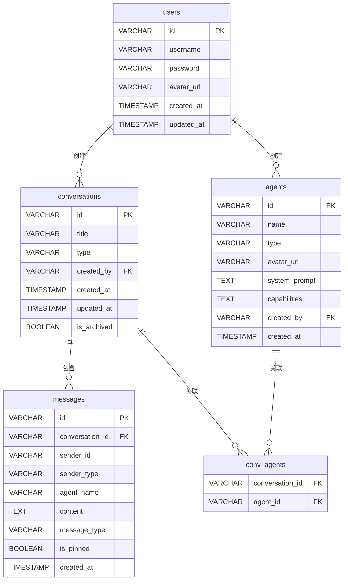

# AgentHub 技术框架文档 — 数据模型设计

> **版本**: v1.0
> **最后更新**: 2026-05-25

---

## 1. 数据库 ER 图


**关系说明**

- `users` 与 `conversations`：一名用户可以创建多个会话（一对多）。
- `conversations` 与 `messages`：一个会话包含多条消息（一对多）。
- `users` 与 `agents`：一名用户可以创建多个 Agent（一对多，可为空）。
- `conversations` 与 `agents`：多对多关系，通过 `conv_agents` 关联表维护。

---

## 2. 数据表详细定义

### 2.1 users 表

| 字段 | 类型 | 约束 | 说明 |
|------|------|------|------|
| `id` | `VARCHAR(36)` | `PRIMARY KEY` | UUID 主键 |
| `username` | `VARCHAR(50)` | `UNIQUE, NOT NULL` | 用户名 |
| `password` | `VARCHAR(255)` | `NOT NULL` | 加密后的密码（BCrypt） |
| `avatar_url` | `VARCHAR(500)` | `NULLABLE` | 头像 URL |
| `created_at` | `TIMESTAMP` | `NOT NULL, DEFAULT NOW()` | 创建时间 |
| `updated_at` | `TIMESTAMP` | `NOT NULL, DEFAULT NOW()` | 更新时间 |

### 2.2 conversations 表

| 字段 | 类型 | 约束 | 说明 |
|------|------|------|------|
| `id` | `VARCHAR(36)` | `PRIMARY KEY` | UUID 主键 |
| `title` | `VARCHAR(200)` | `NOT NULL` | 会话标题 |
| `type` | `VARCHAR(20)` | `NOT NULL` | `direct`（单聊）或 `group`（群聊） |
| `created_by` | `VARCHAR(36)` | `FOREIGN KEY → users.id, NOT NULL` | 创建者用户 ID |
| `created_at` | `TIMESTAMP` | `NOT NULL, DEFAULT NOW()` | 创建时间 |
| `updated_at` | `TIMESTAMP` | `NOT NULL, DEFAULT NOW()` | 最后活跃时间 |
| `is_archived` | `BOOLEAN` | `NOT NULL, DEFAULT FALSE` | 是否归档 |

### 2.3 conv_agents 表（关联表）

| 字段 | 类型 | 约束 | 说明 |
|------|------|------|------|
| `conversation_id` | `VARCHAR(36)` | `FOREIGN KEY → conversations.id, NOT NULL` | 会话 ID |
| `agent_id` | `VARCHAR(36)` | `FOREIGN KEY → agents.id, NOT NULL` | Agent ID |

> **联合主键**: `(conversation_id, agent_id)`

### 2.4 messages 表

| 字段 | 类型 | 约束 | 说明 |
|------|------|------|------|
| `id` | `VARCHAR(36)` | `PRIMARY KEY` | UUID 主键 |
| `conversation_id` | `VARCHAR(36)` | `FOREIGN KEY → conversations.id, NOT NULL` | 所属会话 ID |
| `sender_id` | `VARCHAR(36)` | `NOT NULL` | 发送者 ID（用户或 Agent） |
| `sender_type` | `VARCHAR(20)` | `NOT NULL` | `user` 或 `agent` |
| `agent_name` | `VARCHAR(100)` | `NULLABLE` | Agent 显示名称（当 `sender_type='agent'` 时填充） |
| `content` | `TEXT` | `NOT NULL` | **JSON 格式**的消息内容（详见 3.1） |
| `message_type` | `VARCHAR(30)` | `NOT NULL` | 消息类型（详见 3.1） |
| `is_pinned` | `BOOLEAN` | `NOT NULL, DEFAULT FALSE` | 是否被用户固定 |
| `created_at` | `TIMESTAMP` | `NOT NULL, DEFAULT NOW()` | 发送时间 |

### 2.5 agents 表

| 字段 | 类型 | 约束 | 说明 |
|------|------|------|------|
| `id` | `VARCHAR(36)` | `PRIMARY KEY` | UUID 主键 |
| `name` | `VARCHAR(100)` | `NOT NULL` | Agent 显示名称 |
| `type` | `VARCHAR(50)` | `NOT NULL` | Agent 类型：`claude_code` / `codex` / `custom` |
| `avatar_url` | `VARCHAR(500)` | `NULLABLE` | 头像 URL |
| `system_prompt` | `TEXT` | `NULLABLE` | 系统提示词（自定义 Agent 用） |
| `capabilities` | `TEXT` | `NULLABLE` | **JSON 数组**，能力标签列表 |
| `created_by` | `VARCHAR(36)` | `FOREIGN KEY → users.id, NULLABLE` | 创建者 ID（自定义 Agent 有值） |
| `created_at` | `TIMESTAMP` | `NOT NULL, DEFAULT NOW()` | 创建时间 |

---

## 3. 关键字段格式说明

### 3.1 Message.content JSON 结构

`content` 字段存储结构化 JSON，`message_type` 字段标识类型。两者配合实现多类型消息渲染。

#### 文本消息（message_type = "text"）

```json
{
  "type": "text",
  "text": "你好，我来帮你生成一个 React 组件"
}
```
#### 代码消息（message_type = "code"）
```json
{
  "type": "code",
  "language": "javascript",
  "code": "import React from 'react';\n\nconst App = () => {\n  return <div>Hello</div>;\n};",
  "filename": "App.jsx"
}
```
#### Diff 消息（message_type = "diff"）
```json
{
  "type": "diff",
  "originalCode": "const a = 1;",
  "modifiedCode": "const a = 2;",
  "language": "javascript",
  "filename": "utils.js"
}
```
#### 预览卡片消息（message_type = "preview_card"）
```json
{
  "type": "preview_card",
  "title": "博客主页预览",
  "description": "生成的 HTML 页面，包含导航栏和文章列表",
  "previewUrl": "http://localhost:8080/artifacts/preview_abc123.html",
  "fileType": "html"
}
```
### 3.2 Agent.capabilities JSON 结构
```json
[
  "代码生成",
  "代码审查",
  "Debug",
  "重构建议",
  "文档编写"
]
```
## 4. JPA 实体类代码骨架
### 4.1 User.java
```java
package com.agenthub.model;

import jakarta.persistence.*;
import java.time.LocalDateTime;

@Entity
@Table(name = "users")
public class User {

    @Id
    private String id;

    @Column(unique = true, nullable = false, length = 50)
    private String username;

    @Column(nullable = false)
    private String password;

    @Column(name = "avatar_url", length = 500)
    private String avatarUrl;

    @Column(name = "created_at", nullable = false)
    private LocalDateTime createdAt;

    @Column(name = "updated_at", nullable = false)
    private LocalDateTime updatedAt;

    @PrePersist
    public void prePersist() {
        this.id = java.util.UUID.randomUUID().toString();
        this.createdAt = LocalDateTime.now();
        this.updatedAt = LocalDateTime.now();
    }

    @PreUpdate
    public void preUpdate() {
        this.updatedAt = LocalDateTime.now();
    }

    // Getters and Setters（使用 Lombok @Data 可替代）
}
```
### 4.2 Conversation.java
```java
package com.agenthub.model;

import jakarta.persistence.*;
import java.time.LocalDateTime;
import java.util.HashSet;
import java.util.Set;

@Entity
@Table(name = "conversations")
public class Conversation {

    @Id
    private String id;

    @Column(nullable = false, length = 200)
    private String title;

    @Column(nullable = false, length = 20)
    private String type;  // "direct" | "group"

    @Column(name = "created_by", nullable = false)
    private String createdBy;

    @Column(name = "created_at", nullable = false)
    private LocalDateTime createdAt;

    @Column(name = "updated_at", nullable = false)
    private LocalDateTime updatedAt;

    @Column(name = "is_archived", nullable = false)
    private Boolean isArchived = false;

    // 多对多关联 Agent
    @ManyToMany
    @JoinTable(
        name = "conv_agents",
        joinColumns = @JoinColumn(name = "conversation_id"),
        inverseJoinColumns = @JoinColumn(name = "agent_id")
    )
    private Set<Agent> agents = new HashSet<>();

    @PrePersist
    public void prePersist() {
        this.id = java.util.UUID.randomUUID().toString();
        this.createdAt = LocalDateTime.now();
        this.updatedAt = LocalDateTime.now();
    }

    @PreUpdate
    public void preUpdate() {
        this.updatedAt = LocalDateTime.now();
    }

    // Getters and Setters
}
```
### 4.3 Message.java
```java
package com.agenthub.model;

import jakarta.persistence.*;
import java.time.LocalDateTime;

@Entity
@Table(name = "messages")
public class Message {

    @Id
    private String id;

    @Column(name = "conversation_id", nullable = false)
    private String conversationId;

    @Column(name = "sender_id", nullable = false)
    private String senderId;

    @Column(name = "sender_type", nullable = false, length = 20)
    private String senderType;  // "user" | "agent"

    @Column(name = "agent_name", length = 100)
    private String agentName;

    @Column(columnDefinition = "TEXT", nullable = false)
    private String content;  // JSON 字符串

    @Column(name = "message_type", nullable = false, length = 30)
    private String messageType;  // "text" | "code" | "diff" | "preview_card"

    @Column(name = "is_pinned", nullable = false)
    private Boolean isPinned = false;

    @Column(name = "created_at", nullable = false)
    private LocalDateTime createdAt;

    @PrePersist
    public void prePersist() {
        this.id = java.util.UUID.randomUUID().toString();
        this.createdAt = LocalDateTime.now();
    }

    // Getters and Setters
}
```
### 4.4 Agent.java
```java
package com.agenthub.model;

import jakarta.persistence.*;
import java.time.LocalDateTime;

@Entity
@Table(name = "agents")
public class Agent {

    @Id
    private String id;

    @Column(nullable = false, length = 100)
    private String name;

    @Column(nullable = false, length = 50)
    private String type;  // "claude_code" | "codex" | "custom"

    @Column(name = "avatar_url", length = 500)
    private String avatarUrl;

    @Column(name = "system_prompt", columnDefinition = "TEXT")
    private String systemPrompt;

    @Column(name = "capabilities", columnDefinition = "TEXT")
    private String capabilities;  // JSON 数组字符串

    @Column(name = "created_by")
    private String createdBy;

    @Column(name = "created_at", nullable = false)
    private LocalDateTime createdAt;

    @PrePersist
    public void prePersist() {
        this.id = java.util.UUID.randomUUID().toString();
        this.createdAt = LocalDateTime.now();
    }

    // Getters and Setters
}
```
## 5. 数据库初始化数据
### 5.1 预置 Agent 数据
```sql
-- 启动时通过 JPA data.sql 或代码初始化
-- 文件位置: backend-java/src/main/resources/data.sql

INSERT INTO agents (id, name, type, avatar_url, system_prompt, capabilities, created_at)
VALUES
(
    'agent_claude_001',
    'Claude Code',
    'claude_code',
    '/avatars/claude.png',
    '你是一个经验丰富的软件工程师，擅长前端开发、代码审查和问题调试。请用中文回复。',
    '["代码生成", "代码审查", "Debug", "重构建议", "文档编写"]',
    NOW()
),
(
    'agent_codex_001',
    'Codex',
    'codex',
    '/avatars/codex.png',
    '你是一个全栈开发专家，擅长快速生成高质量代码，并能解释技术原理。',
    '["代码生成", "全栈开发", "技术问答", "代码优化"]',
    NOW()
);
```
## 6. 索引建议
```sql
-- 高频查询字段建议添加索引
-- JPA 可自动创建部分索引，以下为手动优化参考

-- 按会话查询消息（最高频）
CREATE INDEX idx_messages_conversation_id ON messages(conversation_id);

-- 按更新时间排序会话列表
CREATE INDEX idx_conversations_updated_at ON conversations(updated_at DESC);

-- 按用户名登录查询
CREATE INDEX idx_users_username ON users(username);

-- 消息固定状态查询
CREATE INDEX idx_messages_pinned ON messages(conversation_id, is_pinned)
    WHERE is_pinned = TRUE;
```