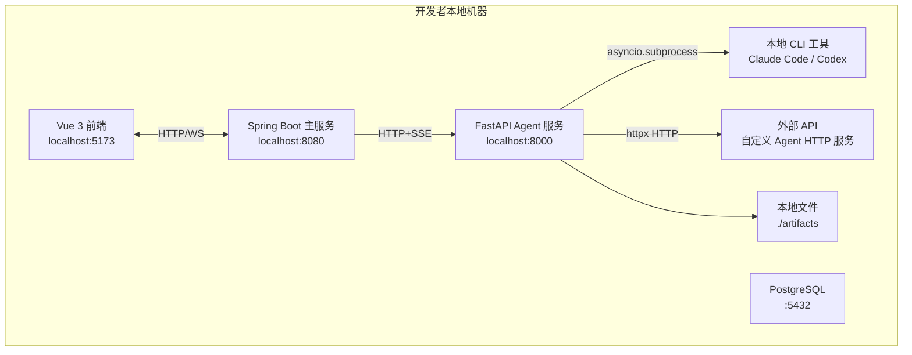
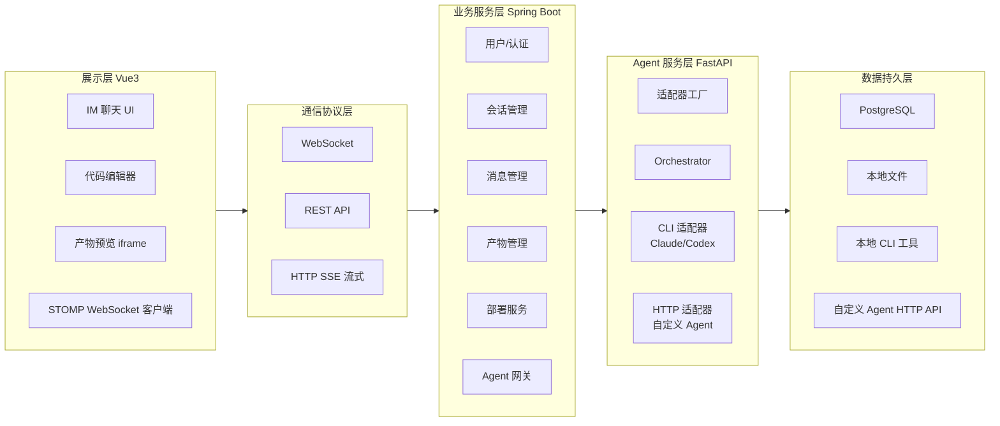
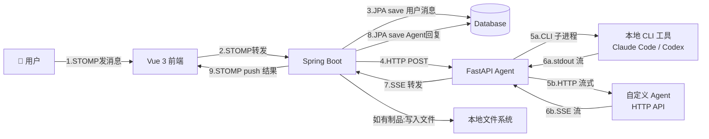
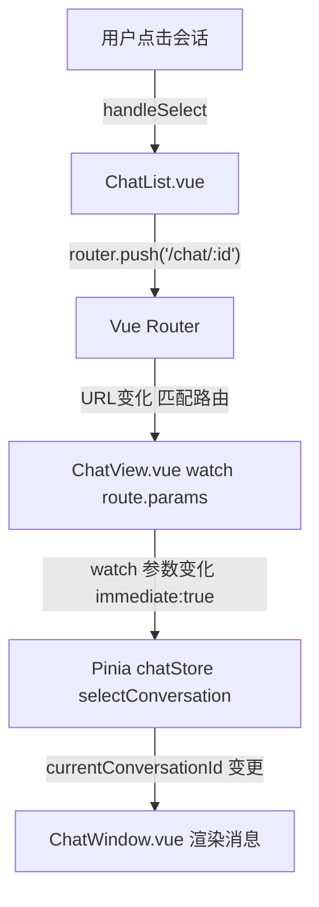

# AgentHub 技术框架文档 — 架构拓扑图与项目目录结构

> **版本**: v1.2  
> **最后更新**: 2026-05-28


---

## 1. 架构拓扑图

### 1.1 物理架构（开发环境）


### 1.2 逻辑架构（分层视图）


### 1.3 消息数据流（完整时序）

以下为一次用户与 Agent 对话的完整数据流转路径：

```
步骤 1 ── 用户发送消息
   用户 ──► Vue Frontend (5173)

步骤 2 ── 前端通过 WebSocket 发送给 Java 后端
   Vue Frontend ──STOMP──► Spring Boot (8080)
   WebSocketController.handleUserMessage()

步骤 3 ── 持久化用户消息
   Spring Boot ──JPA save()──► database
   写入 messages 表 (sender_type = "user")

步骤 4 ── 转发给 Agent 服务
   Spring Boot (AgentGatewayService) ──HTTP POST──► FastAPI (8000)

步骤 5 ── Agent 服务调用 Agent
   FastAPI (Adapter) ──CLI 子进程──► 本地 claude/codex CLI
   或 FastAPI (HttpApiAdapter) ──HTTP POST──► 自定义 Agent API

步骤 6 ── Agent 流式响应返回
   CLI stdout / HTTP SSE stream ──► FastAPI

步骤 7 ── Agent 服务转发流式结果
   FastAPI ──SSE stream──► Spring Boot (WebClient)

步骤 8 ── 持久化 Agent 回复
   Spring Boot ──JPA save()──► database
   写入 messages 表 (sender_type = "agent")

步骤 9 ── 推送给前端 + 制品存储
   Spring Boot (SimpMessagingTemplate) ──STOMP──► Vue Frontend
   如有代码/网页生成，写入 ./artifacts/ 并返回 artifact_id
```



### 1.4 各层数据职责分工

```
┌─────────────────────────────────────────────────────────────────┐
│                        数据归属                                   │
│                                                                 │
│  Java 端 (Spring Boot)        │  Python 端 (FastAPI)            │
│  ┌───────────────────────┐    │  ┌───────────────────────────┐  │
│  │ 唯一的数据持久化层      │    │  │ 无状态协议转换网关          │  │
│  │ • 用户、会话、消息 CRUD │    │  │ • 不持有数据库             │  │
│  │ • 制品文件存储          │    │  │ • 不存储任何业务数据        │  │
│  │ • MVP: H2 内存数据库    │    │  │ • 职责: 接收消息 → 通过     │  │
│  │ • P1: PostgreSQL 持久化 │    │  │   CLI 子进程或 HTTP 调用    │  │
│  └───────────────────────┘    │  │   Agent → 流式转发结果       │  │
│                                 │  └───────────────────────────┘  │
│                                                                 │
│  前端 (Vue 3)                                                   │
│  ┌───────────────────────────────────────────────────────────┐  │
│  │ 纯展示层                                                    │  │
│  │ • 通过 STOMP WebSocket 实时收发消息                          │  │
│  │ • 通过 REST API 获取历史数据                                 │  │
│  │ • 不直连数据库，不直连 Python Agent 服务                      │  │
│  └───────────────────────────────────────────────────────────┘  │
└─────────────────────────────────────────────────────────────────┘
```

> **关键设计原则**：Java 后端是**唯一的数据权威**（Single Source of Truth）。Python Agent 服务是一个**无状态的协议转换网关**，只在请求的生命周期内存在，不持久化任何数据。Agent 调用支持两种方式并行：Claude Code / Codex 通过本地 CLI 子进程调用（可读写文件、执行 Shell），自定义 Agent 通过 HTTP API 调用。前端不直连数据库或 Agent 服务，所有数据通过 Java 后端中转。

### 1.5 前端路由数据流（Vue Router v4）

C9 任务完成后，前端从"状态驱动"改造为"路由驱动"，URL 成为单一真相来源。以下为路由规范：

**当前路由表（router/index.ts）**：

| Path | Name | 组件 | 说明 |
|------|------|------|------|
| `/` | - | Redirect | 永久重定向 → `/chat/conv_frontend_001` |
| `/chat/:conversationId` | `chat` | `views/ChatView.vue` | 单聊视图（聊天气泡布局），动态路由参数为会话 ID |
| `/office` | `office` | `views/OfficeView.vue` | 办公室视图（SVG 场景），懒加载按需加载 |

**路由分发规则**：点击会话时根据 `ConversationSummary.type` 自动分发：
- `type === 'direct'` → 路由 `/chat/:conversationId` → ChatView
- `type === 'group'` → 路由 `/office/:conversationId`（P2 预留）→ OfficeView

**路由驱动数据流完整链路**：



**关键特性说明**：
1. **`{ immediate: true }`**：ChatView 中的 watch 首次挂载时立即执行，直接访问 URL 不白屏
2. **History 模式**：干净 URL，无 `#`，生产环境 nginx 需配置 fallback 到 `index.html`
3. **命名路由判断激活态**：SideBar 用 `route.name === 'chat'` 而非 path.startsWith，与路径格式解耦
4. **OfficeView 懒加载**：`() => import()` 拆分 chunk，首屏不加载 SVG/动画代码

**新增路由标准流程**：
1. 在 `router/index.ts` 的 `routes` 数组中新增一条 route 配置
2. 在 `views/` 目录下新建对应的视图入口组件
3. App.vue 和 SideBar 无需任何修改
---

## 2. 项目目录结构

### 2.1 完整目录树

 ```text
agenthub/
│
├── frontend/ # Vue 3 前端项目
│ ├── public/
│ │ └── favicon.ico
│ ├── src/
│ │ ├── api/ # 后端 API 调用封装
│ │ │ ├── index.js # Axios 实例配置
│ │ │ ├── conversation.js # 会话相关 API
│ │ │ └── agent.js # Agent 相关 API
│ │ │
│ │ ├── components/ # 组件
│ │ │ ├── chat/ # 聊天核心组件
│ │ │ │ ├── ConversationList.vue # 左侧会话列表
│ │ │ │ ├── ConversationItem.vue # 单个会话项
│ │ │ │ ├── ChatWindow.vue # 聊天主窗口
│ │ │ │ ├── MessageBubble.vue # 消息气泡（根据类型渲染）
│ │ │ │ ├── MessageInput.vue # 底部输入框 + 发送按钮
│ │ │ │ ├── AgentSelector.vue # Agent 选择下拉框
│ │ │ │ └── TypingIndicator.vue # "正在输入..."动画
│ │ │ │
│ │ │ ├── preview/ # 产物预览组件
│ │ │ │ ├── PreviewCard.vue # 内联预览卡片（iframe）
│ │ │ │ ├── CodeBlock.vue # 代码块高亮展示
│ │ │ │ ├── DiffView.vue # Diff 对比视图
│ │ │ │ └── CodeEditor.vue # Monaco 编辑器弹窗/侧边栏
│ │ │ │
│ │ │ └── common/ # 通用组件
│ │ │ ├── Avatar.vue # 头像
│ │ │ └── LoadingSpinner.vue # 加载动画
│ │ │
│ │ ├── stores/ # Pinia 状态管理
│ │ │ ├── chatStore.js # 聊天核心状态
│ │ │ ├── userStore.js # 用户登录状态
│ │ │ └── agentStore.js # Agent 列表、能力标签
│ │ │
│ │ ├── websocket/ # WebSocket 客户端
│ │ │ └── wsClient.js # STOMP 连接、订阅、发送封装
│ │ │
│ │ ├── utils/ # 工具函数
│ │ │ ├── messageParser.js # 消息内容解析
│ │ │ └── dateFormatter.js # 时间格式化
│ │ │
│ │ ├── views/ # 页面视图
│ │ │ ├── LoginView.vue # 登录页
│ │ │ ├── RegisterView.vue # 注册页
│ │ │ ├── ChatView.vue # 聊天主页面
│ │ │ └── SettingsView.vue # 设置页（自建 Agent 等）
│ │ │
│ │ ├── router/
│ │ │ └── index.js # 路由配置
│ │ ├── App.vue # 根组件
│ │ └── main.js # 入口文件
│ │
│ ├── index.html
│ ├── package.json
│ ├── vite.config.js
│ └── .env.development # 开发环境变量
│
├── backend-java/ # Spring Boot 主服务
│ ├── src/main/java/com/agenthub/
│ │ ├── AgenthubApplication.java # 启动类
│ │ │
│ │ ├── config/ # 配置类
│ │ │ ├── WebSocketConfig.java # WebSocket STOMP 配置
│ │ │ ├── SecurityConfig.java # Spring Security 配置
│ │ │ ├── CorsConfig.java # 跨域配置
│ │ │ └── ArtifactConfig.java # 静态资源映射（产物预览）
│ │ │
│ │ ├── controller/ # 控制器
│ │ │ ├── ConversationController.java # 会话 CRUD REST API
│ │ │ ├── MessageController.java # 消息历史查询 REST API
│ │ │ ├── AgentController.java # Agent 管理 REST API
│ │ │ ├── ArtifactController.java # 产物上传/下载 REST API
│ │ │ └── WebSocketController.java # WebSocket 消息处理（核心）
│ │ │
│ │ ├── service/ # 业务逻辑
│ │ │ ├── ConversationService.java # 会话管理
│ │ │ ├── MessageService.java # 消息存储与上下文构建
│ │ │ ├── AgentGatewayService.java # Agent 网关（调用 Python 服务）
│ │ │ ├── ArtifactService.java # 产物管理
│ │ │ └── WebSocketSessionManager.java # WebSocket 会话管理（内存）
│ │ │
│ │ ├── model/ # JPA 实体
│ │ │ ├── User.java # 用户
│ │ │ ├── Conversation.java # 会话
│ │ │ ├── Message.java # 消息
│ │ │ └── Agent.java # Agent 定义
│ │ │
│ │ ├── repository/ # JPA Repository
│ │ │ ├── UserRepository.java
│ │ │ ├── ConversationRepository.java
│ │ │ ├── MessageRepository.java
│ │ │ └── AgentRepository.java
│ │ │
│ │ └── dto/ # 数据传输对象
│ │ ├── SendMessageRequest.java # 前端发送消息请求体
│ │ ├── AgentChatRequest.java # 调用 Python Agent 请求体
│ │ ├── ConversationDTO.java # 会话列表返回体
│ │ └── MessageChunk.java # WebSocket 推送消息块
│ │
│ ├── src/main/resources/
│ │ ├── application.yml # 应用配置
│ │ └── application-dev.yml # 开发环境配置
│ │
│ ├── pom.xml # Maven 依赖
│ └── Dockerfile # 可选：部署用
│
├── agent-service/ # Python FastAPI Agent 服务
│ ├── main.py # FastAPI 入口，注册 4 套 REST API 路由
│ ├── models.py # Pydantic 完整数据模型（Agent/Conversation/Message，与 Java 端完全对齐）
│ ├── config.py # pydantic-settings 全局配置管理，自动加载 .env 和环境变量
│ │
│ ├── adapters/ # LLM 适配器集群（策略模式）
│ │ ├── __init__.py
│ │ ├── base_adapter.py # 抽象基类，统一 chat_stream 接口契约
│ │ ├── adapter_factory.py # 适配器工厂，根据 agent_type 返回对应实例
│ │ ├── claude_adapter.py # Claude Code CLI 适配器（asyncio.subprocess）
│ │ ├── codex_adapter.py # OpenAI Codex CLI 适配器（asyncio.subprocess）
│ │ └── http_adapter.py # 自定义 Agent HTTP API 适配器（httpx，D13 任务）
│ │
│ ├── app/ # API 端点分层目录
│ │ ├── api/ # REST API 端点模块
│ │ │ ├── __init__.py
│ │ │ └── endpoints/ # 端点模块
│ │ │     └── messages.py # SSE 流式对话核心端点 /api/agent/chat
│ │ │
│ ├── prompts/ # System Prompt 模板库
│ │ └── system_prompts.py # Coder/Designer/Reviewer/Architect 默认提示词
│ │
│ ├── orchestrator.py # Orchestrator 多 Agent 调度逻辑（P2 功能）
│ ├── requirements.txt # Python 依赖（fastapi、httpx、pydantic-settings 等）
│ └── Dockerfile # 可选：部署用
│
├── docker-compose.yml # 本地开发基础设施（PostgreSQL）
├── .gitignore
└── README.md # 项目说明 + 快速启动指南
```

### 2.2 目录职责速查

#### 前端（frontend/）

| 目录/文件 | 职责 |
|-----------|------|
| `src/api/` | 封装所有后端 REST API 调用（axios） |
| `src/components/chat/` | 聊天核心 UI 组件 |
| `src/components/preview/` | 产物预览相关组件 |
| `src/stores/` | Pinia 状态管理，全局共享状态 |
| `src/websocket/` | WebSocket 客户端封装 |
| `src/views/` | 页面级组件，对应路由 |

#### 后端主服务（backend-java/）

| 目录/文件 | 职责 |
|-----------|------|
| `config/` | Spring 配置类（WebSocket、安全、跨域） |
| `controller/` | REST API 控制器 + WebSocket 消息处理器 |
| `service/` | 业务逻辑层 |
| `model/` | JPA 实体类，映射数据库表 |
| `repository/` | 数据访问层接口 |
| `dto/` | 数据传输对象，定义请求/响应格式 |

#### Agent 服务（agent-service/）

| 目录/文件 | 职责 |
|-----------|------|
| `main.py` | FastAPI 应用入口，注册 4 套模块化 REST API 路由 |
| `config.py` | pydantic-settings 全局配置管理，自动加载环境变量和 .env 文件 |
| `models.py` | Pydantic 三层数据模型，与 Java 后端 JPA 实体完全对齐 |
| `adapters/` | Agent 适配器集群（Claude Code CLI / Codex CLI / 自定义 HTTP API） |
| `app/api/endpoints/` | API 端点模块（单一 /api/agent/chat 端点） |
| `orchestrator.py` | 多 Agent 调度逻辑（P2 功能） |
| `prompts/` | System Prompt 模板库（Coder/Designer/Reviewer/Architect） |

---

## 3. Agent Service 分层架构说明

### 3.1 当前分层设计

Agent Service 采用简约分层架构，各层职责清晰解耦：

| 层级 | 说明 | 与外部依赖耦合度 |
|------|------|-------------|
| API 端点层 | FastAPI 路由处理器，参数校验 + 响应序列化 | 零耦合 |
| Pydantic 模型层 | AgentChatRequest/Response 数据定义 | 零耦合 |
| 适配器工厂层 | 根据 `agentType` 路由到对应适配器实例 | 零耦合 |
| 适配器实现层 | CLI 适配器（asyncio.subprocess）+ HTTP 适配器（httpx） | 与本地 CLI 工具或外部 HTTP 服务耦合 |

### 3.2 CLI + HTTP API 共存架构

Agent Service 同时支持两种 Agent 调用方式，对上层端点完全透明：

```
POST /api/agent/chat {agentType: "..."}
  → AdapterFactory.get_adapter(agentType)
    ├── "claude_code" → ClaudeAdapter → asyncio.subprocess("claude", "-p", prompt)
    ├── "codex"       → CodexAdapter  → asyncio.subprocess("codex", "exec", prompt)
    └── "custom"      → HttpApiAdapter(D13) → httpx.stream(POST, agent_url, json)
```

- **CLI 方式**：Claude Code / Codex 通过本地子进程运行，可读写文件、执行 Shell，输出经 ANSI 去色后流式返回
- **HTTP API 方式**：自定义 Agent 通过 OpenAI 兼容的 Chat Completions API 调用，SSE 流式解析
