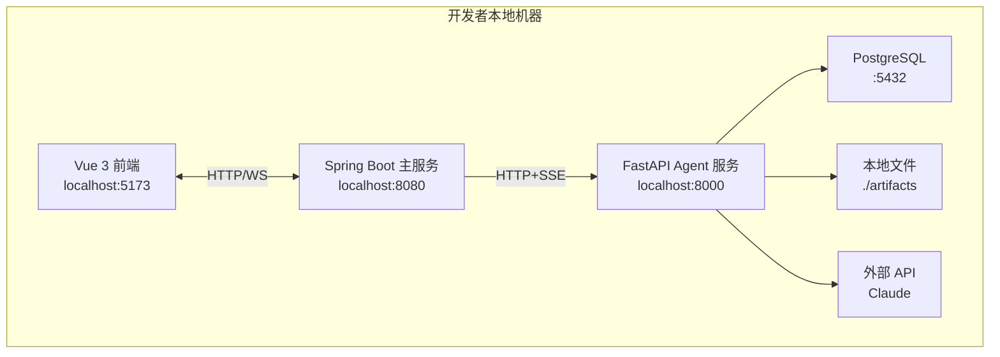
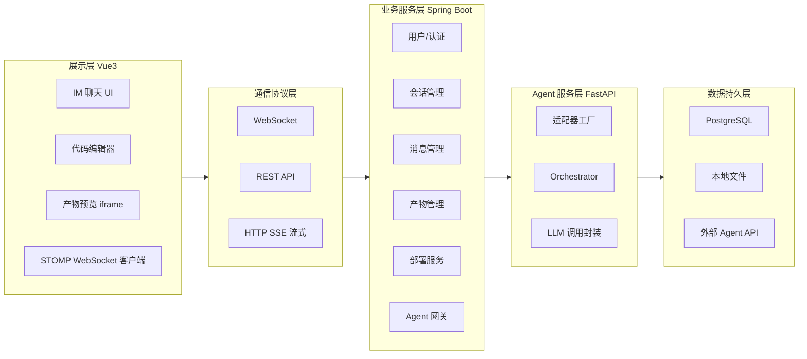
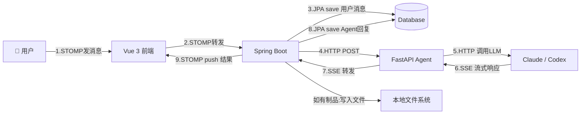

# AgentHub 技术框架文档 — 架构拓扑图与项目目录结构

> **版本**: v1.0  
> **最后更新**: 2026-05-25

---

## 1. 架构拓扑图

### 1.1 物理架构（开发环境）


### 1.2 逻辑架构（分层视图）


### 1.3 消息数据流（完整时序）

以下为一次用户与 Agent 对话的完整数据流转路径：

```
步骤 1 ── 用户发送消息
   用户 ──► Vue Frontend (5173)

步骤 2 ── 前端通过 WebSocket 发送给 Java 后端
   Vue Frontend ──STOMP──► Spring Boot (8080)
   WebSocketController.handleUserMessage()

步骤 3 ── 持久化用户消息
   Spring Boot ──JPA save()──► database
   写入 messages 表 (sender_type = "user")

步骤 4 ── 转发给 Agent 服务
   Spring Boot (AgentGatewayService) ──HTTP POST──► FastAPI (8000)

步骤 5 ── Agent 服务调用 LLM
   FastAPI (Adapter) ──HTTP POST──► Claude / Codex API

步骤 6 ── LLM 流式响应返回
   Claude/Codex ──SSE stream──► FastAPI

步骤 7 ── Agent 服务转发流式结果
   FastAPI ──SSE stream──► Spring Boot (WebClient)

步骤 8 ── 持久化 Agent 回复
   Spring Boot ──JPA save()──► database
   写入 messages 表 (sender_type = "agent")

步骤 9 ── 推送给前端 + 制品存储
   Spring Boot (SimpMessagingTemplate) ──STOMP──► Vue Frontend
   如有代码/网页生成，写入 ./artifacts/ 并返回 artifact_id
```



### 1.4 各层数据职责分工

```
┌─────────────────────────────────────────────────────────────────┐
│                        数据归属                                   │
│                                                                 │
│  Java 端 (Spring Boot)        │  Python 端 (FastAPI)            │
│  ┌───────────────────────┐    │  ┌───────────────────────────┐  │
│  │ 唯一的数据持久化层      │    │  │ 无状态中转节点              │  │
│  │ • 用户、会话、消息 CRUD │    │  │ • 不持有数据库             │  │
│  │ • 制品文件存储          │    │  │ • 不存储任何业务数据        │  │
│  │ • MVP: H2 内存数据库    │    │  │ • 职责: 接收消息 → 调用    │  │
│  │ • P1: PostgreSQL 持久化 │    │  │   LLM → 流式转发结果       │  │
│  └───────────────────────┘    │  └───────────────────────────┘  │
│                                                                 │
│  前端 (Vue 3)                                                   │
│  ┌───────────────────────────────────────────────────────────┐  │
│  │ 纯展示层                                                    │  │
│  │ • 通过 STOMP WebSocket 实时收发消息                          │  │
│  │ • 通过 REST API 获取历史数据                                 │  │
│  │ • 不直连数据库，不直连 Python Agent 服务                      │  │
│  └───────────────────────────────────────────────────────────┘  │
└─────────────────────────────────────────────────────────────────┘
```

> **关键设计原则**：Java 后端是**唯一的数据权威**（Single Source of Truth）。Python Agent 服务是一个**无状态的协议转换网关**，只在请求的生命周期内存在，不持久化任何数据。前端不直连数据库或 Agent 服务，所有数据通过 Java 后端中转。这确保了数据一致性、安全边界清晰、各层可独立部署和扩展。
---

## 2. 项目目录结构

### 2.1 完整目录树

 ```text
agenthub/
│
├── frontend/ # Vue 3 前端项目
│ ├── public/
│ │ └── favicon.ico
│ ├── src/
│ │ ├── api/ # 后端 API 调用封装
│ │ │ ├── index.js # Axios 实例配置
│ │ │ ├── conversation.js # 会话相关 API
│ │ │ └── agent.js # Agent 相关 API
│ │ │
│ │ ├── components/ # 组件
│ │ │ ├── chat/ # 聊天核心组件
│ │ │ │ ├── ConversationList.vue # 左侧会话列表
│ │ │ │ ├── ConversationItem.vue # 单个会话项
│ │ │ │ ├── ChatWindow.vue # 聊天主窗口
│ │ │ │ ├── MessageBubble.vue # 消息气泡（根据类型渲染）
│ │ │ │ ├── MessageInput.vue # 底部输入框 + 发送按钮
│ │ │ │ ├── AgentSelector.vue # Agent 选择下拉框
│ │ │ │ └── TypingIndicator.vue # "正在输入..."动画
│ │ │ │
│ │ │ ├── preview/ # 产物预览组件
│ │ │ │ ├── PreviewCard.vue # 内联预览卡片（iframe）
│ │ │ │ ├── CodeBlock.vue # 代码块高亮展示
│ │ │ │ ├── DiffView.vue # Diff 对比视图
│ │ │ │ └── CodeEditor.vue # Monaco 编辑器弹窗/侧边栏
│ │ │ │
│ │ │ └── common/ # 通用组件
│ │ │ ├── Avatar.vue # 头像
│ │ │ └── LoadingSpinner.vue # 加载动画
│ │ │
│ │ ├── stores/ # Pinia 状态管理
│ │ │ ├── chatStore.js # 聊天核心状态
│ │ │ ├── userStore.js # 用户登录状态
│ │ │ └── agentStore.js # Agent 列表、能力标签
│ │ │
│ │ ├── websocket/ # WebSocket 客户端
│ │ │ └── wsClient.js # STOMP 连接、订阅、发送封装
│ │ │
│ │ ├── utils/ # 工具函数
│ │ │ ├── messageParser.js # 消息内容解析
│ │ │ └── dateFormatter.js # 时间格式化
│ │ │
│ │ ├── views/ # 页面视图
│ │ │ ├── LoginView.vue # 登录页
│ │ │ ├── RegisterView.vue # 注册页
│ │ │ ├── ChatView.vue # 聊天主页面
│ │ │ └── SettingsView.vue # 设置页（自建 Agent 等）
│ │ │
│ │ ├── router/
│ │ │ └── index.js # 路由配置
│ │ ├── App.vue # 根组件
│ │ └── main.js # 入口文件
│ │
│ ├── index.html
│ ├── package.json
│ ├── vite.config.js
│ └── .env.development # 开发环境变量
│
├── backend-java/ # Spring Boot 主服务
│ ├── src/main/java/com/agenthub/
│ │ ├── AgenthubApplication.java # 启动类
│ │ │
│ │ ├── config/ # 配置类
│ │ │ ├── WebSocketConfig.java # WebSocket STOMP 配置
│ │ │ ├── SecurityConfig.java # Spring Security 配置
│ │ │ ├── CorsConfig.java # 跨域配置
│ │ │ └── ArtifactConfig.java # 静态资源映射（产物预览）
│ │ │
│ │ ├── controller/ # 控制器
│ │ │ ├── ConversationController.java # 会话 CRUD REST API
│ │ │ ├── MessageController.java # 消息历史查询 REST API
│ │ │ ├── AgentController.java # Agent 管理 REST API
│ │ │ ├── ArtifactController.java # 产物上传/下载 REST API
│ │ │ └── WebSocketController.java # WebSocket 消息处理（核心）
│ │ │
│ │ ├── service/ # 业务逻辑
│ │ │ ├── ConversationService.java # 会话管理
│ │ │ ├── MessageService.java # 消息存储与上下文构建
│ │ │ ├── AgentGatewayService.java # Agent 网关（调用 Python 服务）
│ │ │ ├── ArtifactService.java # 产物管理
│ │ │ └── WebSocketSessionManager.java # WebSocket 会话管理（内存）
│ │ │
│ │ ├── model/ # JPA 实体
│ │ │ ├── User.java # 用户
│ │ │ ├── Conversation.java # 会话
│ │ │ ├── Message.java # 消息
│ │ │ └── Agent.java # Agent 定义
│ │ │
│ │ ├── repository/ # JPA Repository
│ │ │ ├── UserRepository.java
│ │ │ ├── ConversationRepository.java
│ │ │ ├── MessageRepository.java
│ │ │ └── AgentRepository.java
│ │ │
│ │ └── dto/ # 数据传输对象
│ │ ├── SendMessageRequest.java # 前端发送消息请求体
│ │ ├── AgentChatRequest.java # 调用 Python Agent 请求体
│ │ ├── ConversationDTO.java # 会话列表返回体
│ │ └── MessageChunk.java # WebSocket 推送消息块
│ │
│ ├── src/main/resources/
│ │ ├── application.yml # 应用配置
│ │ └── application-dev.yml # 开发环境配置
│ │
│ ├── pom.xml # Maven 依赖
│ └── Dockerfile # 可选：部署用
│
├── agent-service/ # Python FastAPI Agent 服务
│ ├── main.py # FastAPI 入口，路由定义
│ ├── models.py # Pydantic 请求/响应模型
│ ├── config.py # 配置（API Key、外部地址等）
│ │
│ ├── adapters/ # Agent 适配器
│ │ ├── init.py
│ │ ├── base_adapter.py # 抽象基类（定义接口契约）
│ │ ├── adapter_factory.py # 适配器工厂
│ │ ├── claude_adapter.py # Claude Code 适配器
│ │ └── codex_adapter.py # Codex 适配器（待实现）
│ │
│ ├── orchestrator.py # Orchestrator 调度逻辑（P1 功能）
│ │
│ ├── prompts/ # Prompt 模板
│ │ └── system_prompts.py # 各类 Agent 的 System Prompt
│ │
│ ├── requirements.txt # Python 依赖
│ └── Dockerfile # 可选：部署用
│
├── docker-compose.yml # 本地开发基础设施（PostgreSQL）
├── .gitignore
└── README.md # 项目说明 + 快速启动指南
```

### 2.2 目录职责速查

#### 前端（frontend/）

| 目录/文件 | 职责 |
|-----------|------|
| `src/api/` | 封装所有后端 REST API 调用（axios） |
| `src/components/chat/` | 聊天核心 UI 组件 |
| `src/components/preview/` | 产物预览相关组件 |
| `src/stores/` | Pinia 状态管理，全局共享状态 |
| `src/websocket/` | WebSocket 客户端封装 |
| `src/views/` | 页面级组件，对应路由 |

#### 后端主服务（backend-java/）

| 目录/文件 | 职责 |
|-----------|------|
| `config/` | Spring 配置类（WebSocket、安全、跨域） |
| `controller/` | REST API 控制器 + WebSocket 消息处理器 |
| `service/` | 业务逻辑层 |
| `model/` | JPA 实体类，映射数据库表 |
| `repository/` | 数据访问层接口 |
| `dto/` | 数据传输对象，定义请求/响应格式 |

#### Agent 服务（agent-service/）

| 目录/文件 | 职责 |
|-----------|------|
| `main.py` | FastAPI 应用入口，路由定义 |
| `adapters/` | Agent 适配器（策略模式） |
| `orchestrator.py` | 多 Agent 调度逻辑 |
| `prompts/` | System Prompt 模板管理 |